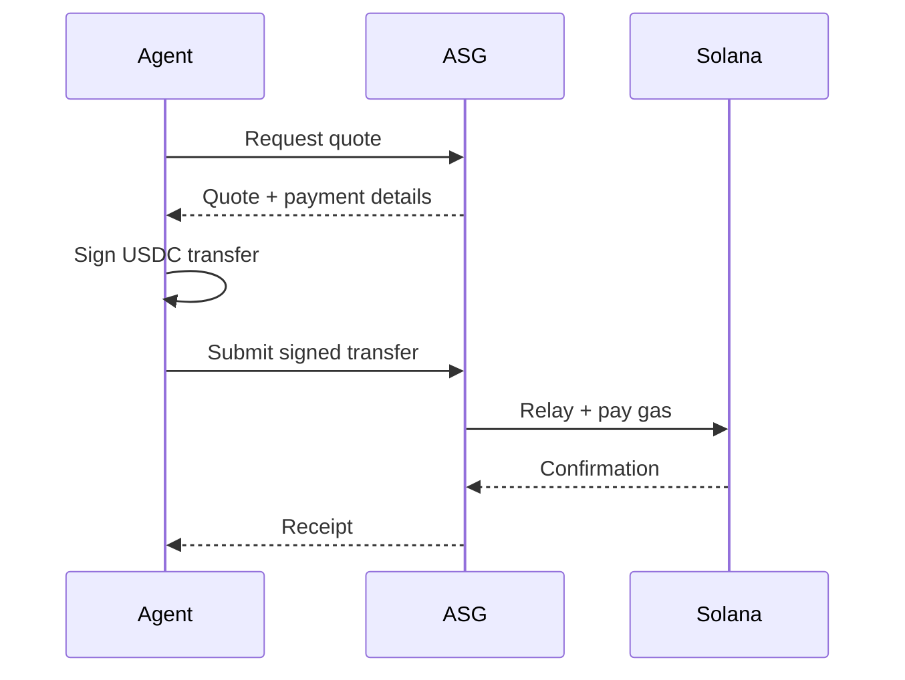

# Gasless Payments

With ASG, you pay only in USDC — we handle all blockchain transaction fees.

## What is Gasless?

On Solana, every transaction requires a small fee (gas). With ASG:

| Traditional Payment | Gasless Payment |
|:-------------------|:----------------|
| You need USDC | You need USDC |
| You need SOL for fees | **We pay the SOL** |
| You sign + pay gas | You sign, we relay |
| Complex for agents | **Simple for agents** |

## How It Works

## Benefits

### For Agents
- **Single token** — Only need USDC, no SOL management
- **Simpler integration** — No gas estimation
- **No stuck transactions** — We handle retries

### For Developers
- **Better UX** — Users don't need to understand gas
- **Predictable costs** — No gas price volatility
- **Unified accounting** — Everything in USD

## Technical Details

<Note>
**Implementation:** We sponsor transaction fees using fee-payer relayers. The USDC transfer is still fully on-chain and verifiable.
</Note>

## Supported Networks

Currently: **Solana Mainnet**

## FAQ

<AccordionGroup>
  <Accordion title="Is there a limit on gasless transactions?">
    Standard rate limits apply (see API docs). No per-transaction limits.
  </Accordion>
  <Accordion title="How do you cover the gas fees?">
    Gas costs are included in our service pricing. No separate charges.
  </Accordion>
  <Accordion title="What if my transaction fails?">
    If ASG fails to relay your transaction, no payment is taken.
  </Accordion>
</AccordionGroup>
