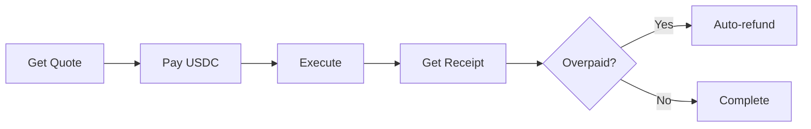

# Billing Overview

ASG uses a simple, transparent billing model: **pay-per-use with instant settlement**.

## The Model

## Key Principles

### 1. Prepaid Only

All usage is prepaid. You pay for a Quote, then execute. No credit lines, no invoices.

### 2. Micro-USD Precision

All amounts are in **microusd** — 1/1,000,000 of a USD:
- $1.00 = 1,000,000 microusd
- $0.01 = 10,000 microusd
- $0.000001 = 1 microusd

### 3. Instant Settlement

Payments settle on Solana in ~400ms. No waiting.

### 4. Automatic Refunds

If you overpay (quote vs. actual), the difference is automatically returned.

## Flow Example

| Step | What Happens | Amount |
|:-----|:-------------|:-------|
| 1. **Quote** | Request inference, get price | Quote: $0.10 |
| 2. **Pay** | Send USDC on Solana | Paid: $0.10 |
| 3. **Execute** | Tool runs, measures actual cost | Actual: $0.085 |
| 4. **Receipt** | Get proof of work | Debited: $0.085 |
| 5. **Refund** | Difference returned | Refunded: $0.015 |

## Billing Terms

| Term | Definition |
|:-----|:-----------|
| **Quote** | Price commitment with TTL |
| **Payment** | USDC transfer on Solana |
| **Receipt** | Proof of completed work |
| **Refund** | Return of overpayment |

## Next Steps

<CardGroup cols={2}>
  <Card title="Pricing" icon="tag" href="/billing/pricing">
    Detailed rates for all services
  </Card>
  <Card title="Gasless" icon="gas-pump" href="/billing/gasless">
    How we cover transaction fees
  </Card>
  <Card title="Receipts" icon="receipt" href="/billing/receipts">
    Understanding receipts
  </Card>
</CardGroup>
