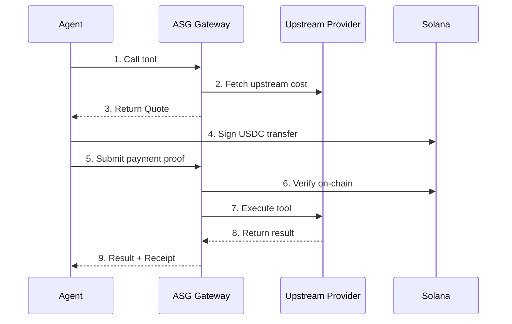

# Billing Transparency

ASG is built on a principle of **full billing transparency**. Every cent is traceable — from quote generation to on-chain settlement. This page explains exactly how your money flows through the system.

## Billing Lifecycle

Every paid tool call follows the same deterministic lifecycle:



---

## Step 1: Quote Generation

When you call a paid tool, ASG calculates the exact price **before** any payment:

1. **Upstream cost lookup** — ASG queries the upstream provider (e.g., OpenAI, Anthropic) for the current rate.
2. **Margin applied** — A transparent margin is added (see [Margin Disclosure](#margin-disclosure) below).
3. **Quote created** — A quote object is returned with the total price in **microUSD** and a time-to-live (TTL).

```json
{
  "quote_id": "qt_20260209_abc123",
  "tool": "inference_chat",
  "amount_microusd": 2400,
  "ttl_seconds": 300,
  "expires_at": "2026-02-09T12:05:00Z"
}
```

<Note>
Quotes expire after their TTL (typically 5 minutes). If a quote expires, request a new one — pricing may have changed.
</Note>

### What determines the price?

| Factor | Example |
|:-------|:--------|
| **Model** | `gpt-4o-mini` vs `claude-sonnet-4` |
| **Token count** | Input + output tokens for inference |
| **Execution time** | Sandbox charges per second |
| **Upstream rate** | Current provider pricing |

---

## Step 2: Payment Verification

After receiving a quote, you sign a USDC transfer on Solana:

1. **Agent signs** — Your agent signs a USDC transfer for the quoted amount to ASG's settlement address.
2. **Proof submitted** — The signed transaction (or its signature) is sent to ASG via the `X-Payment` header or `payment_proof` body field.
3. **On-chain verification** — ASG verifies the transaction on Solana mainnet:
   - Correct amount transferred
   - Correct recipient address
   - Transaction finalized on-chain
4. **Idempotency check** — Each transaction signature can only be used once. Replaying the same proof will not result in a double charge.

```bash
curl -X POST https://agent.asgcompute.com/mcp \
  -H "Content-Type: application/json" \
  -H "X-Payment: <solana_tx_signature>" \
  -d '{
    "jsonrpc": "2.0",
    "id": 1,
    "method": "tools/call",
    "params": {
      "name": "inference_chat",
      "arguments": {
        "model": "openai/gpt-4o-mini",
        "messages": [{"role": "user", "content": "Hello"}]
      }
    }
  }'
```

<Warning>
**Mainnet only** — All payments use Solana mainnet USDC. There is no devnet or testnet mode.
</Warning>

---

## Step 3: Receipt Creation

After successful execution, a receipt is generated and returned in the response:

1. **Receipt minted** — A unique `receipt_id` is created.
2. **Debit recorded** — The exact amount debited is stored (always matches the quote).
3. **Solana reference** — The on-chain transaction signature (`tx_signature`) is linked to the receipt.
4. **Returned to agent** — The receipt metadata is included in the `_meta` field of the tool response.

```json
{
  "result": {
    "content": [{ "type": "text", "text": "Hello! How can I help?" }],
    "_meta": {
      "receipt_id": "rcpt_20260209_def456",
      "quoted_usdc_microusd": 2400,
      "debited_usdc_microusd": 2400,
      "tx_signature": "5UxK...7nPq",
      "tool": "inference_chat",
      "created_at": "2026-02-09T12:00:30Z"
    }
  }
}
```

Every receipt is independently verifiable on the Solana blockchain. See [Receipts](/billing/receipts) for full details.

---

## Step 4: Balance Deductions

If you use **prepaid balance** (deposited USDC) instead of per-call payment:

1. **Balance checked** — Your account balance is verified against the quoted amount.
2. **Atomic deduction** — The exact quoted amount is deducted from your balance atomically.
3. **No partial charges** — If the tool fails after payment, the full amount is refunded to your balance.
4. **Receipt issued** — Same receipt flow as direct payment.

| Scenario | What happens |
|:---------|:-------------|
| Balance ≥ quote | Deduct → Execute → Receipt |
| Balance < quote | Rejected with `insufficient_balance` error |
| Execution fails | Full refund to balance |
| Quote expired | New quote required |

<Note>
Balance deductions are recorded with the same `tx_signature` traceability as direct Solana payments.
</Note>

---

## Margin Disclosure

ASG charges a transparent margin on top of upstream provider costs. Here's how pricing breaks down:

### What you pay

```
Total price = Upstream cost + ASG margin
```

### What the margin covers

| Component | Description |
|:----------|:------------|
| **Infrastructure** | Gateway servers, Solana relayers, monitoring |
| **Gas sponsorship** | We pay all Solana transaction fees ([Gasless](/billing/gasless)) |
| **Reliability** | Automatic retries, failover, idempotency |
| **Developer tools** | Console, receipts, analytics, API key management |

### How to see the breakdown

Every quote includes the total amount. You can compare ASG pricing with upstream provider rates on our [Pricing](/billing/pricing) page.

<Tip>
**Free tools available** — Tools like `get_status` and `echo` are completely free with no margin. Use them to test your integration before making paid calls.
</Tip>

---

## Verification & Audit

Every transaction is auditable:

1. **Receipt lookup** — Query any receipt by ID via the `billing_get_receipt` tool.
2. **On-chain verification** — Every `tx_signature` can be verified on [Solana Explorer](https://explorer.solana.com).
3. **Balance history** — Check your current balance and recent transactions via the Console at [agent.asgcompute.com/console](https://agent.asgcompute.com/console).

For receipt verification details, see the [Receipts](/billing/receipts) guide.

---

## Next Steps

<CardGroup cols={2}>
  <Card title="Pricing" icon="tag" href="/billing/pricing">
    Detailed rates for all services
  </Card>
  <Card title="Receipts" icon="receipt" href="/billing/receipts">
    Verify and query receipts
  </Card>
  <Card title="Gasless Payments" icon="gas-pump" href="/billing/gasless">
    How we cover transaction fees
  </Card>
  <Card title="Billing Overview" icon="file-invoice-dollar" href="/billing/overview">
    High-level billing model
  </Card>
</CardGroup>
