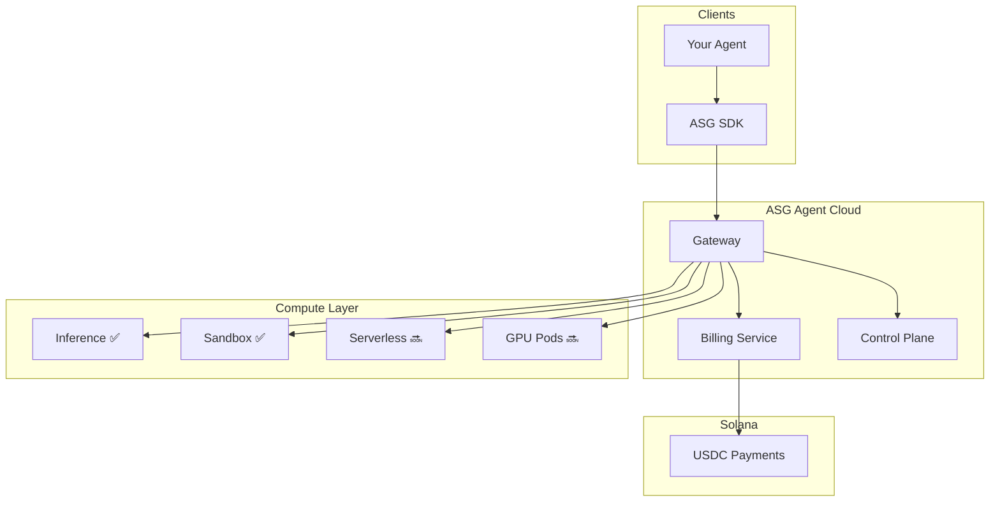

# Architecture

ASG Agent Cloud is designed for reliability, scale, and security.

## System Overview

## Components

### Gateway

The **Gateway** is your primary entry point:
- Handles MCP protocol (Streamable HTTP + SSE)
- Routes tool calls to services
- Enforces rate limits and authentication

### Billing Service

The **Billing Service** manages payments:
- Generates quotes
- Verifies on-chain payments
- Issues receipts

### Control Plane

The **Control Plane** manages execution:
- Run/Step state machine
- Budget enforcement
- Idempotency and deduplication
- Loop detection

### Compute Layer

Two active compute services, with more on the roadmap:

| Service | Status | Use Case |
|:--------|:-------|:---------|
| **Inference** | ✅ Active | AI completions (100+ models) |
| **Sandbox** | ✅ Active | Isolated code execution |
| **Serverless** | 🔜 Coming | Async jobs (Python/Node) |
| **GPU Pods** | 🔜 Coming | Dedicated GPU instances |

## Design Principles

### 1. Non-Custodial

We never hold your private keys. All payments are on-chain.

### 2. Prepaid Only

All usage is prepaid. No credit, no invoices.

### 3. Gasless

You pay only in USDC. We cover all Solana fees.

### 4. Isolated Execution

All code runs in isolated environments with strict egress policies.

---

## Regions

Currently available in **US-West**. Multi-region coming soon.

## SLA

Target availability: **99.9%** (working towards SLA documentation).
