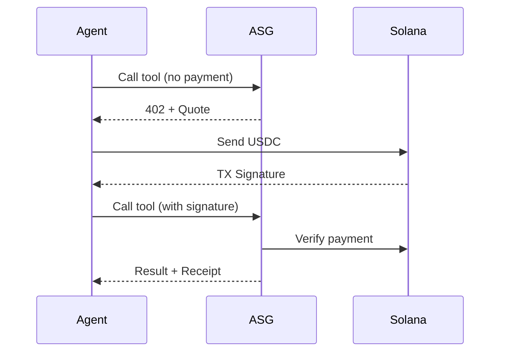

# Core Concepts

Understanding these concepts will help you get the most out of ASG Agent Cloud.

## The Payment Flow

Every paid tool call follows this flow:

## Key Terms

### Quote

A **Quote** is a price commitment for a specific request. It includes:
- `quote_id` — Unique identifier
- `amount_usdc_microusd` — Price in micro-USD (1/1,000,000 of $1)
- `expires_at` — When the quote expires (typically 60 seconds)

### Receipt

A **Receipt** is proof of completed work. It includes:
- `receipt_id` — Unique identifier
- `debited_usdc_microusd` — Actual cost (may differ from quote)
- `step_id` — Reference to the execution step

### Run

A **Run** is a container for related work. Runs have:
- **Budget** — Maximum spend limit
- **TTL** — Time-to-live before auto-cancel
- **Steps** — Individual tool executions

### Step

A **Step** is a single tool execution within a Run. Each Step:
- Has its own budget
- Generates one Receipt
- Can be retried (max 1 retry)

## Budgets

Budgets protect against runaway costs:

| Level | Purpose |
|:------|:--------|
| **Run Budget** | Total spend limit for a Run |
| **Step Budget** | Max spend for a single Step |

If a budget is exceeded, you'll receive a `BUDGET_EXCEEDED` error.

## Idempotency

Every request can include an **idempotency key**. If you retry with the same key:
- Same result returned
- No duplicate charges
- Same receipt

## TTL (Time-to-Live)

Resources have TTLs:
- **Quotes** — 60 seconds default
- **GPU Leases** — Configurable, requires heartbeat *(Coming soon)*
- **Runs** — Configurable per-run

---

## Next Steps

<CardGroup cols={2}>
  <Card title="Architecture" icon="sitemap" href="/guide/architecture">
    System architecture overview
  </Card>
  <Card title="Pricing" icon="credit-card" href="/billing/pricing">
    Detailed pricing information
  </Card>
</CardGroup>
