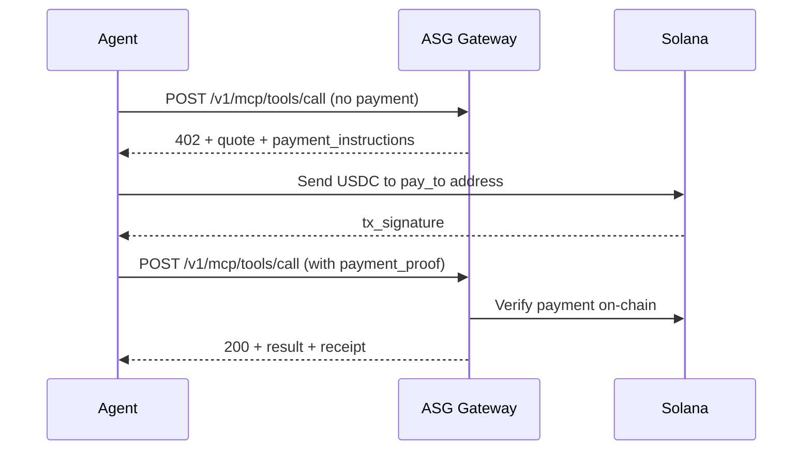

# Payment Flow Guide

<Warning>
**⚠️ Mainnet Only** — All payments use **Solana mainnet USDC**. There is no devnet or testnet mode.
</Warning>

ASG Agent Cloud uses a **2-step payment flow** based on the HTTP 402 Payment Required standard. This guide shows you exactly how it works with copy-paste curl examples.

## How It Works



## Step 1: Request a Quote

Call any billable tool **without** a payment proof. The gateway returns a `402 Payment Required` response with a quote and payment instructions.

```bash
curl -X POST https://agent.asgcompute.com/v1/mcp/tools/call \
  -H "Authorization: Bearer sk-agent-YOUR_KEY" \
  -H "Content-Type: application/json" \
  -d '{
    "tool": "inference_chat",
    "params": {
      "model": "google/gemini-2.0-flash-001",
      "messages": [{"role": "user", "content": "Hello"}]
    }
  }'
```

### 402 Response

```json
{
  "code": "PAYMENT_REQUIRED",
  "message": "Payment required to execute tool",
  "quote": {
    "quote_id": "qt_abc123",
    "tool": "inference_chat",
    "price_usdc_microusd": 10000,
    "price_display": "$0.01",
    "ttl_seconds": 300,
    "expires_at": "2026-02-08T12:05:00Z"
  },
  "payment_instructions": {
    "network": "solana-mainnet",
    "asset": "USDC",
    "pay_to": "<treasury_ata>",
    "usdc_mint": "EPjFWdd5AufqSSqeM2qN1xzybapC8G4wEGGkZwyTDt1v",
    "memo_format": "step_id:quote_id:nonce",
    "methods": ["x402_header", "body_payment_proof"]
  },
  "step_id": "step_xyz"
}
```

<Tip>
Save the `quote_id`, `step_id`, `pay_to`, and `usdc_mint` from this response — you'll need them to build the payment.
</Tip>

## Step 2: Pay and Retry

After sending USDC on Solana mainnet, retry the **same tool call** with your payment proof attached. ASG supports two methods:

### Method A: Body `payment_proof` (Primary)

Include the payment proof directly in the request body:

```bash
curl -X POST https://agent.asgcompute.com/v1/mcp/tools/call \
  -H "Authorization: Bearer sk-agent-YOUR_KEY" \
  -H "Content-Type: application/json" \
  -d '{
    "tool": "inference_chat",
    "params": {
      "model": "google/gemini-2.0-flash-001",
      "messages": [{"role": "user", "content": "Hello"}]
    },
    "payment_proof": {
      "tx_ref": "YOUR_SOLANA_TX_SIGNATURE",
      "amount_usdc": "0.01",
      "memo": "step_xyz:qt_abc123:1",
      "network": "solana-mainnet"
    },
    "idempotency_key": "unique-key-per-request"
  }'
```

### Method B: `X-Payment` Header (x402 Standard)

Encode the payment proof as base64 JSON and pass it in the `X-Payment` header:

```bash
# Encode payment proof as base64 JSON
PAYMENT=$(echo -n '{"tx":"YOUR_SOLANA_TX_SIGNATURE","quote_id":"qt_abc123"}' | base64)

curl -X POST https://agent.asgcompute.com/v1/mcp/tools/call \
  -H "Authorization: Bearer sk-agent-YOUR_KEY" \
  -H "X-Payment: $PAYMENT" \
  -H "Content-Type: application/json" \
  -d '{
    "tool": "inference_chat",
    "params": {
      "model": "google/gemini-2.0-flash-001",
      "messages": [{"role": "user", "content": "Hello"}]
    },
    "idempotency_key": "unique-key"
  }'
```

### Success Response (200)

```json
{
  "ok": true,
  "result": {
    "type": "text",
    "content": "Hello! How can I help you today?"
  },
  "receipt": {
    "receipt_id": "rcpt_123",
    "debited_usdc_microusd": 10000
  }
}
```

## Field Reference

| Field | Description | Example |
|:------|:------------|:--------|
| `tx_ref` | Solana transaction signature (base58) | `5x7Hk...` |
| `amount_usdc` | Amount in USDC (string) | `"0.01"` |
| `memo` | Format: `step_id:quote_id:nonce` | `"step_xyz:qt_abc123:1"` |
| `network` | Must be `solana-mainnet` | `"solana-mainnet"` |
| `idempotency_key` | Unique per request (prevents double-billing) | `"550e8400-..."` |
| `quote_id` | Quote ID from 402 response | `"qt_abc123"` |

## Idempotency

<Note>
Always include an `idempotency_key` with your payment proof. If a request is retried with the same key, ASG returns the cached result **without charging again**. This prevents double-billing on network errors.
</Note>

## Error Handling

| Error Code | Meaning | Action |
|:-----------|:--------|:-------|
| `PAYMENT_REQUIRED` | No payment attached | Get quote, pay, retry |
| `QUOTE_EXPIRED` | Quote TTL exceeded | Request a new quote |
| `INVALID_PAYMENT` | Payment verification failed | Check tx_ref and amount |
| `RATE_LIMITED` | Too many requests | Back off and retry |

## Next Steps

<CardGroup cols={2}>
  <Card title="Tool Availability" icon="wrench" href="/guide/tool-availability">
    See which tools are currently active
  </Card>
  <Card title="Billing Overview" icon="credit-card" href="/billing/overview">
    Understand the billing model
  </Card>
  <Card title="SDK Examples" icon="code" href="/sdk/examples">
    TypeScript examples with payment flow
  </Card>
  <Card title="Payment Contract" icon="file-contract" href="/payment-contract">
    Full technical payment contract reference
  </Card>
</CardGroup>
