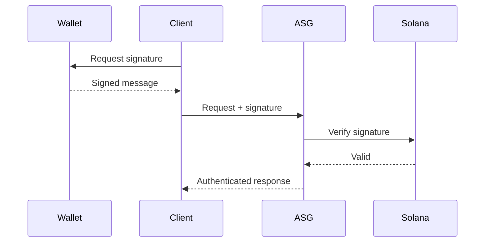

# Authentication

ASG uses Solana wallet signatures for authentication — no API keys or passwords.

## How It Works



## Benefits

| Traditional Auth | Wallet Auth |
|:-----------------|:------------|
| API keys can leak | Private key stays local |
| Keys need management | Wallet handles security |
| Central revocation | Self-sovereign |
| Separate identity | Same identity as payments |

## Implementation

### TypeScript SDK

The SDK handles authentication automatically:

```typescript
import { ASGClient } from '@asgcompute/sdk';

const client = new ASGClient({
  wallet: yourKeypair,
  // Authentication is automatic
});
```

### Manual Authentication

For direct API access, include payment signature:

```json
{
  "params": {
    "_meta": {
      "payment": {
        "tx_signature": "your-solana-tx-signature"
      }
    }
  }
}
```

## Security Considerations

<Warning>
**Never share your private key.** ASG will never ask for it. Only wallet signatures are sent over the network.
</Warning>

## Wallet Support

Compatible with any Solana wallet:
- Phantom
- Solflare
- Backpack
- CLI wallets
