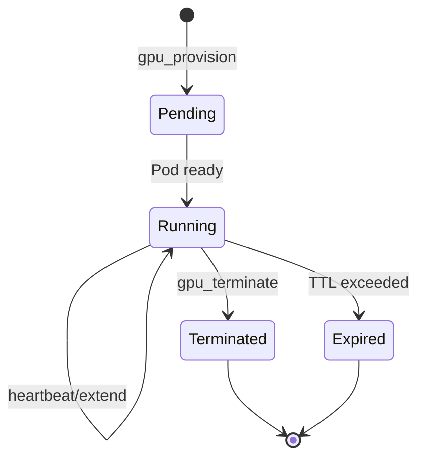

# ASG GPU

Rent dedicated GPU instances on-demand.

## Overview

ASG GPU provides:
- **H100, A100, RTX 4090** — Premium GPUs
- **Per-second billing** — No hourly minimums
- **Instant provisioning** — Usually <30 seconds
- **SSH access** — Full control of your pod

## Quick Example

<CodeGroup>

```bash curl
# Provision a GPU pod
curl -X POST https://agent.asgcompute.com/mcp \
  -H "Content-Type: application/json" \
  -d '{
    "jsonrpc": "2.0",
    "id": 1,
    "method": "tools/call",
    "params": {
      "name": "gpu_provision",
      "arguments": {
        "gpu_type": "RTX_4090",
        "ttl_seconds": 3600
      },
      "_meta": {
        "payment": {"tx_signature": "<your-signature>"}
      }
    }
  }'
```

```typescript TypeScript
const pod = await client.callTool('gpu_provision', {
  gpu_type: 'RTX_4090',
  ttl_seconds: 3600
});

console.log(`Pod ready at: ${pod.endpoint}`);
```

</CodeGroup>

## GPU Types

| Type | VRAM | Best For | Rate |
|:-----|:-----|:---------|:-----|
| `RTX_4090` | 24 GB | Development, fine-tuning | $0.40/hr |
| `A100_40GB` | 40 GB | Training, inference | $1.20/hr |
| `A100_80GB` | 80 GB | Large models | $1.80/hr |
| `H100_80GB` | 80 GB | Maximum performance | $2.50/hr |

## Parameters

| Parameter | Type | Required | Description |
|:----------|:-----|:---------|:------------|
| `gpu_type` | string | Yes | GPU type from table above |
| `ttl_seconds` | number | Yes | Initial lease duration |
| `image` | string | No | Docker image (default: pytorch) |

## Lease Lifecycle



## Managing Leases

### Extend Lease

```typescript
await client.callTool('gpu_heartbeat', {
  lease_id: 'lease_abc123',
  extend_seconds: 1800
});
```

### Terminate Early

```typescript
await client.callTool('gpu_terminate', {
  lease_id: 'lease_abc123'
});
```

<Tip>
**Cost Savings:** Terminate pods when not in use. You're only billed for active time.
</Tip>

## Response

```json
{
  "result": {
    "lease_id": "lease_abc123",
    "status": "running",
    "endpoint": "https://pod-abc123.asg.run",
    "gpu_type": "RTX_4090",
    "expires_at": "2026-02-01T14:00:00Z",
    "_meta": {
      "receipt_id": "rcpt_gpu456"
    }
  }
}
```

## Pricing

See [Pricing](/billing/pricing) for current GPU rates.
